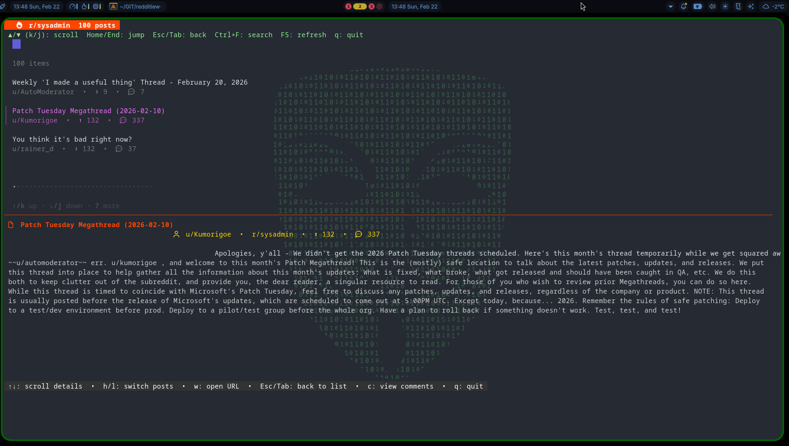
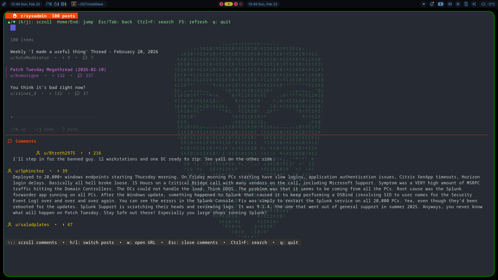
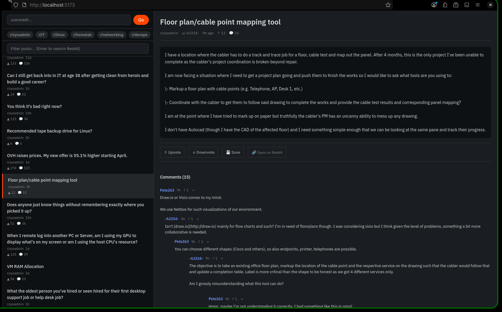

# RedditView - Multi-Interface Reddit Browser

**Repository**: [github.com/nicthegarden/redditiew](https://github.com/nicthegarden/redditiew)

**[🎬 Watch Demo Video](https://www.youtube.com/watch?v=upnz0AzVMn8)**

A modern, feature-rich Reddit client available in both Terminal User Interface (TUI) and Web UI formats. Browse Reddit posts, read comments, and open threads directly from your terminal or web browser.

## 🎯 Features

### Core Functionality
- **Browse Reddit Posts** - Navigate posts from any subreddit with smooth pagination
- **View Comments** - Read threaded discussions with scrollable comment panels
- **Search Posts** - Full-text search across loaded posts
- **Subreddit Switching** - Quickly switch between subreddits without restarting
- **Open in Browser** - Launch post URLs directly in your default browser
- **Real-time Stats** - See post scores, comment counts, and author information

### TUI Application Features
- **Keyboard-Driven Navigation** - Efficient keybindings for power users
- **Split-View Display** - See post list, details, and comments simultaneously
- **Smooth Scrolling** - Arrow keys, Page Up/Down for precise navigation
- **Responsive Design** - Adapts to any terminal size
- **Error Handling** - Graceful error messages and recovery
- **Sort Control** - Toggle between hot and new posts with instant refresh
- **Quick Subreddit Shortcuts** - Configurable 1-9 keyboard shortcuts for favorite subreddits
- **Smart Comment Navigation** - Auto-close comments when switching posts
- **Warning System** - Visual alerts when navigating at comment boundaries

### Web UI Features  
- **Modern UI Design** - Clean, intuitive interface
- **Responsive Layout** - Works on desktop and tablet
- **Real-time Updates** - Live comment and post data
- **Customizable Theme** - Light/dark mode support
- **Sort Toggle** - Switch between hot and new posts
- **Keyboard Shortcuts** - Quick access to favorite subreddits (1-9)

## 🏗️ Why This Architecture? (Proxy Server Design)

RedditView uses a **local proxy server architecture** instead of direct Reddit API access. Here's why this design is perfect for your niche needs:

### The Problem with Direct Reddit API Access
- ❌ Reddit's OAuth2 requires user authentication credentials
- ❌ No "read-only" mode - can't safely embed credentials
- ❌ Rate limiting per endpoint (60 requests/hour per user)
- ❌ Complex authentication workflows in terminal
- ❌ Browser dependencies for OAuth flow

### The Solution: Local Proxy Server
RedditView solves this by running a **lightweight proxy server** that:
- ✅ Fetches Reddit data server-side (bypasses client-side auth)
- ✅ Uses public endpoints (no credentials needed)
- ✅ Centralizes rate limiting and caching
- ✅ Works in terminal without browser
- ✅ Feeds your niche needs: read content without full Reddit UI

### System Architecture

```
┌─────────────────────────────────────────────────────────────────┐
│                        YOU (Your Computer)                       │
├─────────────────────────────────────────────────────────────────┤
│                                                                   │
│  ┌──────────────┐              ┌─────────────────────────────┐  │
│  │   TUI App    │              │    Web Browser/UI           │  │
│  │  (Go Binary) │              │  (Node.js/React Frontend)   │  │
│  │              │              │                             │  │
│  │  • Terminal  │              │  • Modern responsive UI     │  │
│  │  • Keyboard  │              │  • Mouse friendly           │  │
│  │  • Full TTY  │              │  • Same data backend        │  │
│  └──────┬───────┘              └────────────┬────────────────┘  │
│         │                                    │                   │
│         └────────────────┬───────────────────┘                   │
│                          │                                       │
│                          ▼                                       │
│         ┌────────────────────────────────┐                      │
│         │   LOCAL PROXY SERVER (Node.js) │                      │
│         │   Running on localhost:3002    │                      │
│         │                                │                      │
│         │  • Caches Reddit data          │                      │
│         │  • Handles rate limiting       │                      │
│         │  • Provides REST API           │                      │
│         │  • No credentials needed       │                      │
│         └───────────┬────────────────────┘                      │
│                     │                                           │
└─────────────────────┼───────────────────────────────────────────┘
                      │
                      │ (Your Internet Connection)
                      │
                      ▼
            ┌──────────────────┐
            │  reddit.com API  │
            │  Public Endpoints│
            │  (No Auth)       │
            └──────────────────┘
```

### How It Works

**1. Data Flow**
```
Terminal/Browser → Local Proxy → Reddit Public API → Local Proxy → Display
```

**2. Request Example**
```
You: "Show me posts from r/sysadmin"
      ↓
TUI/Web: GET http://localhost:3002/api/r/sysadmin.json
      ↓
Proxy Server:
  - Checks if cached (serve instantly)
  - If not cached, fetches from Reddit
  - Caches result (next request is instant)
  - Returns JSON to your app
      ↓
TUI/Web: Displays posts beautifully
```

**3. Why This Benefits You**
- **Zero Configuration** - No API keys, no OAuth flow
- **Lightning Fast** - Results cached locally
- **Multiple Interfaces** - Same backend, different UIs
- **Offline-ish** - Cached data available without internet
- **Privacy Friendly** - No third-party tracking
- **Self-Contained** - Everything runs locally

### Components

| Component | Language | Purpose |
|-----------|----------|---------|
| **TUI Application** | Go | Terminal interface with Bubble Tea framework |
| **Proxy Server** | Node.js/Express | Local API server, caching, rate limiting |
| **Web UI** | Node.js/React | Browser-based interface (same backend) |

### Key Design Benefits

✅ **Simplicity** - One local server, multiple clients
✅ **Performance** - Built-in caching layer
✅ **Flexibility** - Easy to add new interfaces (CLI, Web, Desktop, etc.)
✅ **Reliability** - No network dependency for cached data
✅ **Scalability** - Can serve multiple instances

---

## 📸 Screenshots

### TUI - Post List View


### TUI - Comments View


### Web UI


## 🚀 Quick Start

### For Linux Users
```bash
# Install dependencies (choose one)
# Ubuntu/Debian
sudo apt-get install golang-go nodejs npm

# Fedora/RHEL
sudo dnf install golang nodejs npm

# Install the application
git clone https://github.com/nicthegarden/redditiew.git
cd redditiew
npm install
go build -o apps/tui/redditview ./apps/tui
npm run build

# Start the server
npm start

# In another terminal, run the TUI
./apps/tui/redditview
```

### For Windows Users
```powershell
# Install dependencies from:
# - Go: https://golang.org/dl
# - Node.js: https://nodejs.org

# Clone and setup
git clone https://github.com/nicthegarden/redditiew.git
cd redditiew
npm install
go build -o apps/tui/redditview.exe ./apps/tui
npm run build

# Start the server
npm start

# In another PowerShell window, run the TUI
.\apps\tui\redditview.exe
```

👉 **See [QUICKSTART.md](QUICKSTART.md) for detailed step-by-step instructions**

## 📖 Documentation

- **[QUICKSTART.md](QUICKSTART.md)** - Get started in 5 minutes (Windows & Linux)
- **[INSTALLATION.md](INSTALLATION.md)** - Detailed installation and build instructions
- **[SYSTEMD_SETUP.md](SYSTEMD_SETUP.md)** - Run as systemd service with auto-start
- **[CONFIGURATION.md](CONFIGURATION.md)** - Configure the application to your preferences
- **[TUI_KEYBINDINGS.md](TUI_KEYBINDINGS.md)** - Complete keyboard shortcut reference
- **[ARCHITECTURE.md](ARCHITECTURE.md)** - Technical architecture and design decisions
- **[DEVELOPMENT.md](DEVELOPMENT.md)** - Contributing and development guide

## 🎮 Complete Keybindings Reference

### Terminal UI (TUI) - Full Keyboard Reference

#### Navigation & Browsing
| Key | Action | Context |
|-----|--------|---------|
| `↑` / `k` | Move cursor up / Scroll up | List view: previous post, Details/Comments: scroll up |
| `↓` / `j` | Move cursor down / Scroll down | List view: next post, Details/Comments: scroll down |
| `Enter` | View post details | List view → Details view |
| `Esc` or `Tab` | Back to list | Details/Comments view → List view |
| `h` / `Left` | Previous post | Details/Comments view |
| `l` / `Right` | Next post | Details/Comments view |
| `Page Up` | Page up | Scroll within any view |
| `Page Down` | Page down | Scroll within any view |

#### Comment Navigation
| Key | Action | Details |
|-----|--------|---------|
| `c` | Toggle comments | Details view: show/hide comments panel |
| `↑` at top | Navigate to previous post | Comments: auto-closes comments and loads previous post |
| `↓` at bottom | Navigate to next post | Comments: auto-closes comments and loads next post |
| `↑`/`↓` in middle | Scroll comments | Normal scrolling when not at boundary |
| **⚠️ Visual Warning** | Shows orange alert | When at comment boundary with next/previous post available |

#### Subreddit & Search
| Key | Action |
|-----|--------|
| `Ctrl+R` | Change subreddit |
| `Ctrl+F` | Search posts |
| `1-9` | Quick jump to favorite subreddit |
| `Esc` | Cancel search or subreddit input |

#### Sorting & Refresh
| Key | Action |
|-----|--------|
| `t` | Toggle sort (Hot ↔ New) |
| `F5` | Refresh posts (F5 or Ctrl+R after subreddit selection) |

#### Utility
| Key | Action |
|-----|--------|
| `w` | Open post in browser |
| `q` / `Ctrl+C` | Quit application |

---

### TUI - View States Explained

#### 📋 List View (Default)
Browse and navigate through posts from the subreddit.
- Show post number, score, comments count
- Shows current sort status: 📊 Hot or 🆕 New
- Navigate with ↑/↓ keys

**Footer shows**: `Post X/Y [Sort Status] • Enter: view • 1-9: subreddit • t: toggle sort • F5: refresh • q: quit`

#### 📄 Details View (Post Content)
View full post content, score, and metadata.
- Scroll through longer post content
- Press `c` to view comments
- See author and subreddit info
- Open URL with `w` key

**Footer shows**: `↑↓: scroll details • h/l: switch posts • w: open URL • Esc/Tab: back to list • c: view comments • t: toggle sort • q: quit`

#### 💬 Comments View (Comments Panel)
Read comments and threaded discussions.
- Scroll through comments
- **Smart boundary warnings** when at top/bottom:
  - ⚠️ Orange warning when at top: `⚠️ Next ↑ will load previous post`
  - ⚠️ Orange warning when at bottom: `⚠️ Next ↓ will load next post`
- Normal footer when scrolling in middle
- Up/Down arrows navigate to next/previous post at boundaries

**Footer shows** (normal): `↑↓: scroll comments • h/l: switch posts • w: open URL • Esc: close comments • Ctrl+F: search • t: toggle sort • q: quit`

**Footer shows** (warning): Orange text indicating boundary navigation

---

## ⚙️ Configuration

Create/edit `config.json` in the project root:

```json
{
  "tui": {
    "default_subreddit": "sysadmin",
    "default_sort": "popular",
    "posts_per_page": 200,
    "list_height": 10,
    "max_title_length": 80,
    "subreddit_shortcuts": {
      "1": "sysadmin",
      "2": "programming",
      "3": "linuxadmin",
      "4": "homelab",
      "5": "devops"
    }
  },
  "web": {
    "default_subreddit": "sysadmin",
    "default_sort": "popular",
    "posts_per_page": 20,
    "theme": "dark"
  },
  "api": {
    "base_url": "http://localhost:3002/api",
    "timeout_seconds": 10
  }
}
```

### Configuration Options

#### TUI Settings
- **`default_subreddit`** - Subreddit to load on startup (default: "sysadmin")
- **`default_sort`** - Default sort order: "popular" or "new" (default: "popular")
- **`posts_per_page`** - Number of posts to fetch (default: 200)
- **`list_height`** - Height of post list in split view (default: 10)
- **`max_title_length`** - Truncate titles longer than this (default: 80)
- **`subreddit_shortcuts`** - Map 1-9 keys to favorite subreddits

#### Web Settings
- **`default_subreddit`** - Subreddit to load in browser (default: "sysadmin")
- **`default_sort`** - Default sort order: "popular" or "new" (default: "popular")
- **`posts_per_page`** - Posts displayed per page (default: 20)
- **`theme`** - UI theme: "light" or "dark" (default: "dark")

#### API Settings
- **`base_url`** - API server URL (default: "http://localhost:3002/api")
- **`timeout_seconds`** - HTTP request timeout (default: 10)

👉 **See [CONFIGURATION.md](CONFIGURATION.md) for detailed configuration options**

## 🏗️ Project Structure

```
redditiew/
├── apps/
│   ├── tui/                    # Terminal User Interface (Go)
│   │   ├── main.go            # TUI application with full keybindings
│   │   └── redditview         # Compiled binary
│   └── web/                   # Web interface (placeholder)
├── packages/
│   ├── api/                   # API server implementation
│   └── reddit-scraper/        # Reddit data scraper
├── api-server.js              # Express API server with caching
├── config.json                # Configuration file
├── package.json               # Node.js dependencies
├── README.md                  # This file
├── QUICKSTART.md              # Quick start guide
├── CONFIGURATION.md           # Configuration reference
└── ARCHITECTURE.md            # Technical architecture
```

## 🔧 System Requirements

### Minimum Requirements
- **Go** 1.19+ (for TUI)
- **Node.js** 16+ (for API server)
- **npm** 7+
- **Terminal** with 80x24 character minimum

### Recommended
- **Go** 1.21+
- **Node.js** 18+ LTS
- **Terminal** with 120x40 character minimum for best experience
- **Modern OS** (Windows 10+, Ubuntu 20.04+, macOS 10.15+)

## 🌐 API Reference

The application uses a local REST API server running on `localhost:3002`.

### Key Endpoints

**Get Posts from Subreddit**
```
GET /api/r/:subreddit.json?limit=200
GET /api/r/:subreddit/:sort.json?limit=200
```

**Get Comments for Post**
```
GET /api/r/:subreddit/comments/:postid
```

**Get Configuration**
```
GET /api/config
```
Returns default sort and subreddit shortcuts configuration.

**Search Posts**
```
GET /api/search.json?q=query&type=link&limit=200
```

See the API server implementation in `api-server.js` for complete details.

## 🐛 Troubleshooting

### TUI Won't Start
```bash
# Check if API server is running
curl http://localhost:3002/api/r/sysadmin.json

# Rebuild the binary
cd apps/tui && go build -o redditview .

# Check Go installation
go version
```

### TUI Hangs on Quit
- **Fixed in v0.4.0** - HTTP requests now timeout after 30 seconds
- Application will exit cleanly even with pending requests
- Previous versions may have hung indefinitely

### Comments Not Loading
- Ensure API server is running: `npm start`
- Check your internet connection
- Verify the subreddit name is valid
- Try refreshing with `F5`
- Check terminal window height (must be at least 24 lines)

### Sort Toggle Not Working
- Ensure config.json has valid `default_sort` value ("popular" or "new")
- API server must be running
- Check that `/api/config` endpoint is accessible

### Performance Issues
- Increase terminal window size (minimum 80x24, recommended 120x40)
- Reduce `posts_per_page` in config.json
- Ensure system has at least 512MB RAM
- Try closing other applications to free memory

### API Server Port Conflict
```bash
# If port 3002 is in use, edit api-server.js to use different port
# Or kill the existing process on port 3002
lsof -i :3002  # macOS/Linux
netstat -ano | findstr :3002  # Windows
```

## 📋 System Support

| OS | Status | Notes |
|----|---------| ------|
| Linux | ✅ Fully Supported | Tested on Ubuntu, Fedora, Arch |
| Windows | ✅ Fully Supported | Windows 10 and newer |
| macOS | ✅ Fully Supported | Intel and Apple Silicon |

## 🔗 Key Dependencies

### Backend
- **Go** - TUI application language
- **Bubble Tea** - TUI framework for elegant terminal UIs
- **Lipgloss** - Terminal styling and rendering
- **Node.js/Express** - API server
- **Axios** - HTTP client

### Frontend (Web)
- **React** - UI framework
- **Tailwind CSS** - Styling
- **Axios** - HTTP client

## 📝 Recent Changes

### Latest Release (v0.4.0)
- ✨ Warning system for comment boundary navigation with orange highlighting
- 🐛 Fixed TUI hang on quit with 30-second HTTP timeout
- 🐛 All HTTP requests now timeout gracefully

### Previous Release (v0.3.0)
- ✨ Smart arrow key navigation in comments view
- ✨ Sort toggle functionality (hot/new posts)
- ✨ Keyboard shortcuts (1-9) for favorite subreddits
- ✨ Auto-close comments when navigating posts
- ✨ Configuration support for defaults

### Previous (v0.2.0)
- ✨ Enhanced comment scrolling with proper height calculation
- ✨ Open posts directly in browser with `w` key
- ✨ Increased page scroll distance for faster navigation
- ✨ 200 posts per page by default (up from 50)
- 🐛 Fixed comment scrolling state propagation
- 🐛 Fixed list display bug affecting post visibility

See [git log](https://github.com/nicthegarden/redditiew/commits) for complete history.

## 🤝 Contributing

We welcome contributions! Please see [DEVELOPMENT.md](DEVELOPMENT.md) for guidelines.

## 📄 License

This project is licensed under the MIT License - see LICENSE file for details.

## 🙋 Support & Feedback

- **Repository**: [GitHub - nicthegarden/redditiew](https://github.com/nicthegarden/redditiew)
- **Issues**: [GitHub Issues](https://github.com/nicthegarden/redditiew/issues)
- **Discussions**: [GitHub Discussions](https://github.com/nicthegarden/redditiew/discussions)
- **Feedback**: Report issues or suggest features on GitHub

## 🎉 Acknowledgments

- [Bubble Tea](https://github.com/charmbracelet/bubbletea) - TUI framework for Go
- [Lipgloss](https://github.com/charmbracelet/lipgloss) - Terminal styling library
- Reddit - Data source (public API)
- Community - Contributors and testers

---

**Happy browsing! 🚀**

For more information, see the [complete documentation](#-documentation).


## 🏗️ Why This Architecture? (Proxy Server Design)

RedditView uses a **local proxy server architecture** instead of direct Reddit API access. Here's why this design is perfect for your niche needs:

### The Problem with Direct Reddit API Access
- ❌ Reddit's OAuth2 requires user authentication credentials
- ❌ No "read-only" mode - can't safely embed credentials
- ❌ Rate limiting per endpoint (60 requests/hour per user)
- ❌ Complex authentication workflows in terminal
- ❌ Browser dependencies for OAuth flow

### The Solution: Local Proxy Server
RedditView solves this by running a **lightweight proxy server** that:
- ✅ Fetches Reddit data server-side (bypasses client-side auth)
- ✅ Uses public endpoints (no credentials needed)
- ✅ Centralizes rate limiting and caching
- ✅ Works in terminal without browser
- ✅ Feeds your niche needs: read content without full Reddit UI

### System Architecture

```
┌─────────────────────────────────────────────────────────────────┐
│                        YOU (Your Computer)                       │
├─────────────────────────────────────────────────────────────────┤
│                                                                   │
│  ┌──────────────┐              ┌─────────────────────────────┐  │
│  │   TUI App    │              │    Web Browser/UI           │  │
│  │  (Go Binary) │              │  (Node.js/React Frontend)   │  │
│  │              │              │                             │  │
│  │  • Terminal  │              │  • Modern responsive UI     │  │
│  │  • Keyboard  │              │  • Mouse friendly           │  │
│  │  • Full TTY  │              │  • Same data backend        │  │
│  └──────┬───────┘              └────────────┬────────────────┘  │
│         │                                    │                   │
│         └────────────────┬───────────────────┘                   │
│                          │                                       │
│                          ▼                                       │
│         ┌────────────────────────────────┐                      │
│         │   LOCAL PROXY SERVER (Node.js) │                      │
│         │   Running on localhost:3002    │                      │
│         │                                │                      │
│         │  • Caches Reddit data          │                      │
│         │  • Handles rate limiting       │                      │
│         │  • Provides REST API           │                      │
│         │  • No credentials needed       │                      │
│         └───────────┬────────────────────┘                      │
│                     │                                           │
└─────────────────────┼───────────────────────────────────────────┘
                      │
                      │ (Your Internet Connection)
                      │
                      ▼
            ┌──────────────────┐
            │  reddit.com API  │
            │  Public Endpoints│
            │  (No Auth)       │
            └──────────────────┘
```

### How It Works

**1. Data Flow**
```
Terminal/Browser → Local Proxy → Reddit Public API → Local Proxy → Display
```

**2. Request Example**
```
You: "Show me posts from r/sysadmin"
      ↓
TUI/Web: GET http://localhost:3002/api/r/sysadmin.json
      ↓
Proxy Server:
  - Checks if cached (serve instantly)
  - If not cached, fetches from Reddit
  - Caches result (next request is instant)
  - Returns JSON to your app
      ↓
TUI/Web: Displays posts beautifully
```

**3. Why This Benefits You**
- **Zero Configuration** - No API keys, no OAuth flow
- **Lightning Fast** - Results cached locally
- **Multiple Interfaces** - Same backend, different UIs
- **Offline-ish** - Cached data available without internet
- **Privacy Friendly** - No third-party tracking
- **Self-Contained** - Everything runs locally

### Components

| Component | Language | Purpose |
|-----------|----------|---------|
| **TUI Application** | Go | Terminal interface with Bubble Tea framework |
| **Proxy Server** | Node.js/Express | Local API server, caching, rate limiting |
| **Web UI** | Node.js/React | Browser-based interface (same backend) |

### Key Design Benefits

✅ **Simplicity** - One local server, multiple clients
✅ **Performance** - Built-in caching layer
✅ **Flexibility** - Easy to add new interfaces (CLI, Web, Desktop, etc.)
✅ **Reliability** - No network dependency for cached data
✅ **Scalability** - Can serve multiple instances

---

## 📸 Screenshots

### TUI - Post List View


### TUI - Comments View


### Web UI


## 🚀 Quick Start

### For Linux Users
```bash
# Install dependencies (choose one)
# Ubuntu/Debian
sudo apt-get install golang-go nodejs npm

# Fedora/RHEL
sudo dnf install golang nodejs npm

# Install the application
git clone https://github.com/yourusername/redditiew-local.git
cd redditiew-local
npm install
go build -o apps/tui/redditview ./apps/tui
npm run build

# Start the server
npm start

# In another terminal, run the TUI
./apps/tui/redditview
```

### For Windows Users
```powershell
# Install dependencies from:
# - Go: https://golang.org/dl
# - Node.js: https://nodejs.org

# Clone and setup
git clone https://github.com/yourusername/redditiew-local.git
cd redditiew-local
npm install
go build -o apps/tui/redditview.exe ./apps/tui
npm run build

# Start the server
npm start

# In another PowerShell window, run the TUI
.\apps\tui\redditview.exe
```

👉 **See [QUICKSTART.md](QUICKSTART.md) for detailed step-by-step instructions**

## 📖 Documentation

- **[QUICKSTART.md](QUICKSTART.md)** - Get started in 5 minutes (Windows & Linux)
- **[INSTALLATION.md](INSTALLATION.md)** - Detailed installation and build instructions
- **[SYSTEMD_SETUP.md](SYSTEMD_SETUP.md)** - Run as systemd service with auto-start
- **[CONFIGURATION.md](CONFIGURATION.md)** - Configure the application to your preferences
- **[TUI_KEYBINDINGS.md](TUI_KEYBINDINGS.md)** - Complete keyboard shortcut reference
- **[ARCHITECTURE.md](ARCHITECTURE.md)** - Technical architecture and design decisions
- **[DEVELOPMENT.md](DEVELOPMENT.md)** - Contributing and development guide

## 🎮 Basic Usage

### Terminal UI (TUI)

**Starting the Application**
```bash
# Ensure API server is running
npm start

# In another terminal
./apps/tui/redditview
```

**Basic Navigation**
| Action | Keys |
|--------|------|
| Browse posts | `j`/`k` or `↑`/`↓` |
| View post details | `Enter` |
| View comments | `c` |
| Scroll details/comments | `↑`/`↓` or `Page Up`/`Page Down` |
| Switch subreddits | `s` |
| Search posts | `Ctrl+F` |
| Open post in browser | `w` |
| Back to list | `Esc` or `Tab` |
| Quit | `q` |

See [TUI_KEYBINDINGS.md](TUI_KEYBINDINGS.md) for complete keybinding documentation.

### Web UI

1. Open http://localhost:3000 in your web browser
2. Select a subreddit from the sidebar
3. Click on any post to view details
4. Click "View Comments" to expand the comment section

## ⚙️ Configuration

Create/edit `config.json` in the project root:

```json
{
  "tui": {
    "default_subreddit": "sysadmin",
    "posts_per_page": 200,
    "list_height": 10,
    "max_title_length": 80
  },
  "web": {
    "default_subreddit": "sysadmin",
    "posts_per_page": 20,
    "theme": "dark"
  },
  "api": {
    "base_url": "http://localhost:3002/api",
    "timeout_seconds": 10
  }
}
```

👉 **See [CONFIGURATION.md](CONFIGURATION.md) for detailed configuration options**

## 🏗️ Project Structure

```
redditiew-local/
├── apps/
│   ├── tui/                    # Terminal User Interface (Go)
│   │   └── main.go            # TUI application
│   └── web/                   # Web interface (placeholder)
├── packages/
│   ├── api/                   # API server implementation
│   └── reddit-scraper/        # Reddit data scraper
├── api-server.js              # API server (JavaScript)
├── config.json                # Configuration file
├── package.json               # Node.js dependencies
├── README.md                  # This file
├── QUICKSTART.md              # Quick start guide
├── CONFIGURATION.md           # Configuration reference
└── ARCHITECTURE.md            # Technical architecture
```

## 🔧 System Requirements

### Minimum Requirements
- **Go** 1.19+ (for TUI)
- **Node.js** 16+ (for API server)
- **npm** 7+
- **Terminal** with 80x24 character minimum

### Recommended
- **Go** 1.21+
- **Node.js** 18+ LTS
- **Terminal** with 120x40 character minimum
- **Modern OS** (Windows 10+, Ubuntu 20.04+, macOS 10.15+)

## 🌐 API Reference

The application uses a local REST API server running on `localhost:3002`.

### Key Endpoints

**Get Posts from Subreddit**
```
GET /api/r/:subreddit.json?limit=200
```

**Get Comments for Post**
```
GET /api/r/:subreddit/comments/:postid
```

See the API server implementation in `api-server.js` for complete details.

## 🐛 Troubleshooting

### TUI Won't Start
```bash
# Check if API server is running
curl http://localhost:3002/api/r/sysadmin.json

# Rebuild the binary
cd apps/tui && go build -o redditview .

# Check Go installation
go version
```

### Comments Not Loading
- Ensure API server is running: `npm start`
- Check your internet connection
- Verify the subreddit name is valid
- Try refreshing with `F5`

### Performance Issues
- Increase terminal window size (minimum 80x24)
- Reduce `posts_per_page` in config.json
- Ensure system has at least 512MB RAM

## 📋 System Support

| OS | Status | Notes |
|----|---------| ------|
| Linux | ✅ Fully Supported | Tested on Ubuntu, Fedora, Arch |
| Windows | ✅ Fully Supported | Windows 10 and newer |
| macOS | ✅ Fully Supported | Intel and Apple Silicon |

## 🔗 Key Dependencies

### Backend
- **Go** - TUI application language
- **Bubble Tea** - TUI framework
- **Node.js/Express** - API server
- **Axios** - HTTP client

### Frontend (Web)
- **React** - UI framework
- **Tailwind CSS** - Styling
- **Axios** - HTTP client

## 📝 Recent Changes

### Latest Features (v0.2.0)
- ✨ Enhanced comment scrolling with proper height calculation
- ✨ Open posts directly in browser with `w` key
- ✨ Increased page scroll distance for faster navigation
- ✨ 200 posts per page by default (up from 50)
- 🐛 Fixed comment scrolling state propagation
- 🐛 Fixed list display bug affecting post visibility

See [git log](https://github.com/yourusername/redditiew-local/commits) for complete history.

## 🤝 Contributing

We welcome contributions! Please see [DEVELOPMENT.md](DEVELOPMENT.md) for guidelines.

## 📄 License

This project is licensed under the MIT License - see LICENSE file for details.

## 🙋 Support & Feedback

- **Repository**: [GitHub - nicthegarden/redditiew](https://github.com/nicthegarden/redditiew)
- **Issues**: [GitHub Issues](https://github.com/nicthegarden/redditiew/issues)
- **Discussions**: [GitHub Discussions](https://github.com/nicthegarden/redditiew/discussions)

## 🎉 Acknowledgments

- [Bubble Tea](https://github.com/charmbracelet/bubbletea) - TUI framework
- [Lipgloss](https://github.com/charmbracelet/lipgloss) - Terminal styling
- Reddit - Data source

---

**Happy browsing! 🚀**

For more information, see the [complete documentation](#-documentation).
